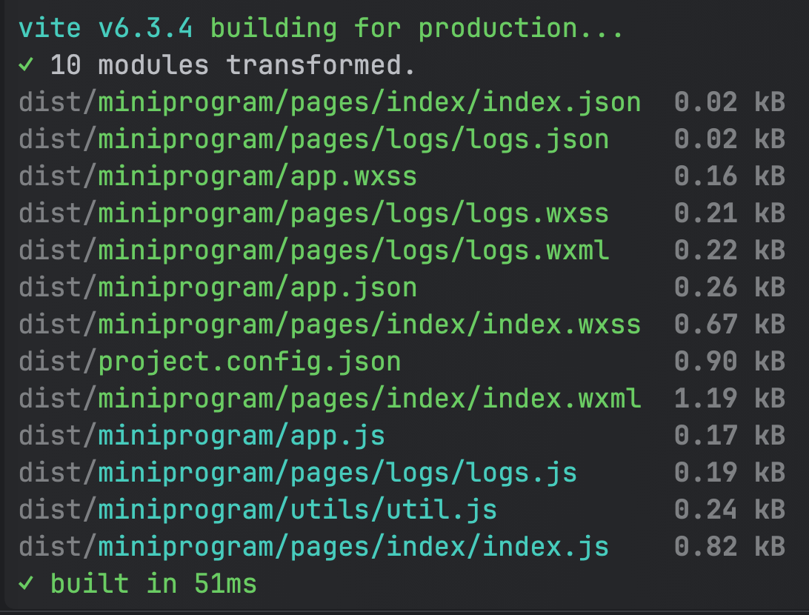

## 使用 Vite 编译微信小程序

该插件使用 Vite 对原生微信小程序编译

## 安装插件

请确保你已安装 [vite 6](https://vite.dev/guide/#manual-installation)

如果还没有安装，请执行：```npm install -D vite```

```bash
npm install -D @dafengzhen/vite-plugin-mp
```

## 使用插件

- **配置插件**

```javascript
import VitePluginMp from '@dafengzhen/vite-plugin-mp';
import { defineConfig } from 'vite';

export default defineConfig({
  plugins: [VitePluginMp()],
});
```

- **编译打包**

```bash
npm run build
```

- **输入输出**

```text
# 输入
miniprogram
├── app.json
├── app.ts
├── app.wxss
├── pages
│   ├── index
│   │   ├── index.json
│   │   ├── index.ts
│   │   ├── index.wxml
│   │   └── index.wxss
│   └── logs
│       ├── logs.json
│       ├── logs.ts
│       ├── logs.wxml
│       └── logs.wxss
└── utils
    └── util.ts
project.config.json
project.private.config.json
```

```text
# 输出
dist
├── miniprogram
│    ├── app.js
│    ├── app.json
│    ├── app.wxss
│    ├── pages
│    │   ├── index
│    │   │   ├── index.js
│    │   │   ├── index.json
│    │   │   ├── index.wxml
│    │   │   └── index.wxss
│    │   └── logs
│    │       ├── logs.js
│    │       ├── logs.json
│    │       ├── logs.wxml
│    │       └── logs.wxss
│    └── utils
│        └── util.js
└── project.config.json
```



## 插件选项

#### `compress?: (html: string | Uint8Array) => Promise<string | Uint8Array> | string | Uint8Array`

自定义函数，用于压缩 HTML 字符串或 `Uint8Array` 输入

- **参数**：
  - `html`：待压缩的内容，可以是字符串或 `Uint8Array`
- **返回值**：
  - 返回压缩后的内容，可以是同步或异步的 `string` 或 `Uint8Array`

配置示例：
```ts
import minifyHtml from '@minify-html/node';

compress: (source) => minifyHtml.minify(Buffer.from(source), {})
```

#### `debug?: boolean`

是否启用详细日志输出，仅有被复制匹配的文件才有日志输出

- **默认值**：`false`

#### `isTsProject?: boolean`

是否为 TypeScript 项目

- **默认值**：`true`

#### `jsonIgnore?: string | string[]`

指定要排除处理的 JSON 文件或目录的 glob 匹配模式

#### `jsonInclude?: string | string[]`

指定要包含处理的 JSON 文件或目录的 glob 匹配模式

配置示例：
```ts
jsonInclude: ['project.private.config.json']
```

#### `outputDir?: string`

输出目录，相对于项目根目录

- **默认值**：`"miniprogram"`

#### `rootDir?: string`

用于解析文件路径的根目录

- **默认值**：`"miniprogram"`

#### `targets?: { src: string; dest: string; }[]`

要复制的目标列表

每个对象代表一个复制规则：

- `src`: 相对于 `rootDir` 的源文件 glob 匹配模式
- `dest`: 相对于 `outputDir` 的目标目录，匹配的文件将被复制到此目录中

配置示例：
```ts
targets: [
  {
    dest: 'assets',
    src: 'assets/**/*.txt',
  },
]
```

## 其他问题

- 适用场景

  原生微信小程序

- 支持版本

  基于 vite 6 编写

- 使用示例

  参考 [examples](https://github.com/dafengzhen/vite-plugin-mp/tree/main/examples) 下的 miniprogram，使用的是微信小程序 ts 基础模版

- 运行项目

  构建完成，会生成 ```dist``` 目录，打开微信小程序开发者工具，选择 ```dist``` 目录导入

## License

[MIT](https://opensource.org/licenses/MIT)
